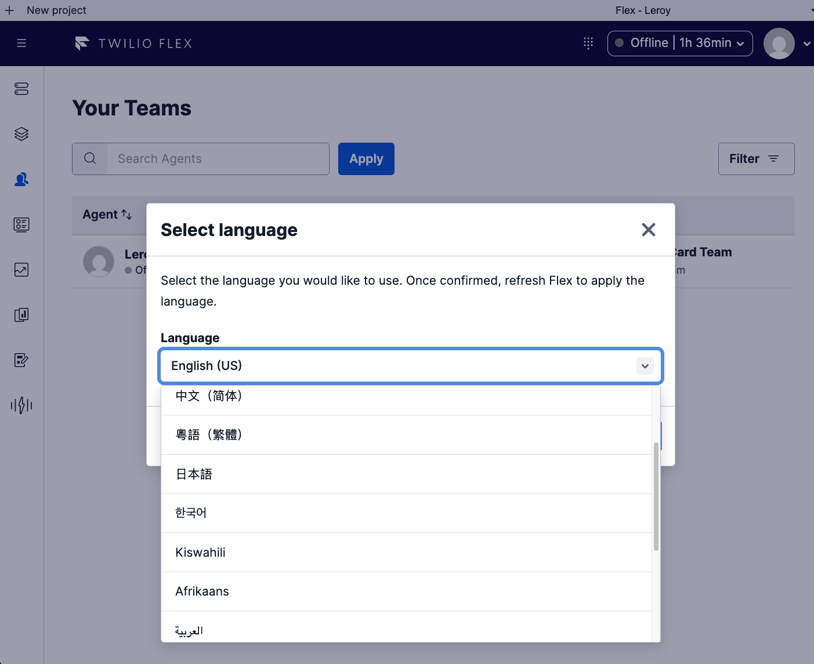

# Twilio Flex Localization Plugin

> **Extending Twilio Flex's native localization to 12 additional languages.**

Twilio Flex ships with a built-in language selector that natively offers **English (US)** (`en-US`), plus **Spanish (Mexico)** (`es-MX`) and **Portuguese (Brazil)** (`pt-BR`) on a provisioned account. This plugin **extends that same native selector** — it does not replace or reinvent it — by registering **12 more fully-translated languages** on top and merging all **1,610** Flex UI strings for each. Users pick a language from the standard Flex modal they already know; everything else just works.

<p align="center">
  
</p>

<p align="center"><em>The plugin plugs directly into Flex's own <strong>Select language</strong> dialog. English (US) — along with the account's native Spanish (Mexico) and Portuguese (Brazil) — sits alongside the 12 languages added by this plugin.</em></p>

Built with **TypeScript** and the Twilio Flex Plugins CLI (`@twilio/flex-plugin` 7.1.2).

---

## Supported locales

Flex natively offers `en-US`, and — on a provisioned account — `es-MX` (Spanish, Mexico) and `pt-BR` (Portuguese, Brazil). This plugin adds the following **12** on top, each with a complete 1,610-string dictionary:

| Tag     | Language                 | Selector label    | Direction |
| ------- | ------------------------ | ----------------- | --------- |
| `zh-CN` | Chinese (Simplified)     | 中文（简体）       | LTR       |
| `yue`   | Chinese (Cantonese)      | 粵語（繁體）       | LTR       |
| `ja`    | Japanese                 | 日本語             | LTR       |
| `ko`    | Korean                   | 한국어             | LTR       |
| `sw`    | Swahili                  | Kiswahili         | LTR       |
| `af`    | Afrikaans                | Afrikaans         | LTR       |
| `ar`    | Arabic (Modern Standard) | العربية            | **RTL**   |
| `hi`    | Hindi                    | हिन्दी             | LTR       |
| `id`    | Indonesian               | Bahasa Indonesia  | LTR       |
| `th`    | Thai                     | ไทย               | LTR       |
| `tl`    | Tagalog / Filipino       | Tagalog           | LTR       |
| `vi`    | Vietnamese               | Tiếng Việt        | LTR       |

The source English strings come from `Twilio Flex 2.17.0 en-US.json` (exported from Flex). Each locale file mirrors that format: `{ name, tag, strings }`.

> **The plugin lives in the [`plugin-localization/`](plugin-localization/) subdirectory** — run all `npm` / `twilio` / `tsc` commands from inside it, not the repo root.

---

## Prerequisites

- **Native Language selection enabled on your Flex account.** This plugin extends Flex's built-in language selector, so that selector must be turned on first. In the Twilio Console go to **Flex → Contact Center Settings → Opt-in Features → Beta → Enable Language selection**. Without this, the languages this plugin registers have nowhere to appear.
- **Node.js** — the Twilio CLI bundles its own Node 20 runtime, which this project builds against. (A newer system Node such as v22 is fine for editing; the CLI uses its own.)
- **Twilio CLI** ≥ 6.x — https://www.twilio.com/docs/twilio-cli/quickstart
- **Flex Plugins CLI plugin**:
  ```bash
  twilio plugins:install @twilio-labs/plugin-flex
  ```
- An **active Twilio CLI profile** for your Flex account (required before build/deploy):
  ```bash
  twilio profiles:list          # list profiles
  twilio profiles:use <name>    # activate one
  ```

---

## Quick start

```bash
# 1. Clone
git clone https://github.com/leroychan/twilio-flex-plugin-localization.git
cd twilio-flex-plugin-localization/plugin-localization

# 2. Install dependencies
npm install

# 3. Point the Twilio CLI at your Flex account
twilio profiles:use <your-profile>

# 4. Run locally (serves Flex at http://localhost:3000)
twilio flex:plugins:start
```

Open http://localhost:3000, then **Settings → Language** — the 12 locales now appear in Flex's native selector.

---

## Full instructions

### Setup

```bash
cd plugin-localization
npm install
```

### Run locally

```bash
twilio flex:plugins:start
```

Compiles the plugin and serves Flex at **http://localhost:3000**.

> ⚠️ `twilio flex:plugins:start` renders an **interactive terminal UI** and must be run in a **real terminal** — it will not stay alive when backgrounded or run without a TTY.

### Typecheck

```bash
npx tsc --noEmit -p tsconfig.json
```

### Build (production bundle)

```bash
twilio flex:plugins:build
```

Output: `build/plugin-localization.js` — a **single** JS bundle (~2.2 MB, because all 12 dictionaries are compiled in). See [Why a single bundle](#why-a-single-bundle-and-why-it-is-large). The `build/` directory is git-ignored and can be deleted after verifying.

> Verify with **both** `tsc --noEmit` and `twilio flex:plugins:build`. A typecheck alone does not catch bundler/runtime problems. Confirm the build produces exactly **one** `plugin-localization.js` with **no numbered chunks** (`2.plugin-localization.js`, etc.).

### Deploy & release

Deploying uploads the bundle; **releasing** enables it on your live Flex application. You need both.

```bash
# Upload a new version
twilio flex:plugins:deploy --changelog "Add 12-language localization"

# Enable it on Flex (use the version printed by the deploy step)
twilio flex:plugins:release \
  --plugin plugin-localization@<version> \
  --name "localization-v1" \
  --description "Custom UI localization: 12 languages"
```

Then visit **https://flex.twilio.com/admin/plugins** to confirm the plugin is live.

> **Version note:** `package.json` starts at `0.0.0`, which the Plugins CLI auto-bumps to `0.0.1` on first deploy. For subsequent deploys, bump the version (`--version` flag or edit `package.json`) or the deploy will be rejected as a duplicate.

---

## How to change the language

**1. End users — Flex language selector.** After the plugin loads, all 12 locales appear in Flex's built-in picker (**Settings → Language**, shown above). Selecting one persists the choice (local-storage key `TWILIO_FLEX_LOCALE_PREFERENCE`) and reloads Flex.

**2. Programmatically.** `src/LocalizationPlugin.tsx` exports a helper:

```ts
import { changeLocale } from './LocalizationPlugin';
await changeLocale('ja'); // switches + persists, then Flex reloads
```

**3. Quick test — browser console** (dev server running):

```js
Twilio.Flex.Manager.getInstance().localization.setLocalePreference('ar');
```

If no preference is set, Flex resolves the locale as: **user preference → account default → browser language → `en-US`**.

---

## Project structure

```
twilio-flex-plugin-localization/
├── README.md                     # this file
├── CLAUDE.md                     # guidance for AI agents working in the repo
├── images/
│   └── plugin.png                # the native selector, extended by this plugin
└── plugin-localization/          # ← the actual plugin (run commands here)
    ├── public/
    │   └── appConfig.js           # local dev config (git-ignored)
    ├── src/
    │   ├── index.ts               # entry point: FlexPlugin.loadPlugin(LocalizationPlugin)
    │   ├── LocalizationPlugin.tsx # plugin class — registers locales + merges strings in init()
    │   ├── strings.ts             # locale registry, bundled imports, helpers
    │   └── locales/               # one JSON per locale (1,610 strings each)
    │       ├── af.json   ar.json   hi.json   id.json
    │       ├── ja.json   ko.json   sw.json   th.json
    │       ├── tl.json   vi.json   yue.json  zh-CN.json
    ├── jest.config.js
    ├── tsconfig.json
    ├── webpack.config.js / webpack.dev.js
    └── package.json
```

---

## How it works

Everything happens in `LocalizationPlugin.init()` (`src/LocalizationPlugin.tsx`), which hooks into Flex's own localization system rather than building a parallel one:

1. **Register locales in the native selector.** `manager.localization` is a getter that returns a *fresh object* on every read, but its `availableLocales` is a reference to Flex's internal array. So we **mutate that array in place** (`.push`) — reassigning the property would be silently dropped and the selector would never show our locales. Entries are de-duped by tag, which is why English (US) stays at the top and our languages are simply appended.

2. **Merge translated strings.** We read `manager.localization.localeTag` (the active locale), look up its dictionary via `getCustomStrings()`, and assign `manager.strings = { ...manager.strings, ...custom }`. Setting `manager.strings` **adds/updates** entries without wiping Flex's defaults. (The assignment is cast to `Flex.Strings` because spreading widens Flex's dynamic `tr_activity_*` index signature to `string | undefined`.)

3. **Apply text direction.** For locales in `RTL_LOCALES` (currently just `ar`), we set `<html dir="rtl" lang="…">` so the UI mirrors correctly.

`src/strings.ts` is the single source of truth for what ships:

- **Static `import`s** of each `./locales/*.json` — deliberate (see below).
- `LOCALE_STRINGS` — map of `tag → strings`.
- `customAvailableLocales` — array of `{ tag, name }` shown in the selector.
- `RTL_LOCALES` — set of right-to-left tags.
- `getCustomStrings(tag)` — synchronous lookup; returns `undefined` for unshipped locales.
- `changeLocale(tag)` — programmatic switch helper (exported from the plugin file).

### Why a single bundle, and why it is large

Locale JSON is imported **statically**, not via dynamic `import()`. Flex serves a plugin as **one JS file** and cannot serve additional webpack chunks. A dynamic `import()` would code-split each locale into its own chunk (`2.plugin-localization.js`, …); at runtime Flex would 404 that request and return the HTML fallback page, producing:

```
Uncaught SyntaxError: Unexpected token '<'
Loading chunk 2 failed. (missing: .../2.plugin-localization.js)
```

Static imports bake every dictionary into the main bundle — correct for Flex, but the bundle grows ~1,610 strings per language (~2.2 MB at 12 locales). The build prints an asset-size warning; that is expected and harmless for a plugin. If you add **many** more languages, consider hosting the locale JSONs externally and pointing Flex's `localesUrl` at them instead of bundling.

---

## Adding a new language

1. Create `src/locales/<tag>.json` in the exported Flex format:
   ```json
   { "name": "Display Name", "tag": "<tag>", "strings": { "InputPlaceHolder": "…", "…": "…" } }
   ```
   It **must** contain all 1,610 keys, and every value must preserve the source's Handlebars placeholders (`{{name}}`, `{{count}}`, `{{#if isPlural}}…{{/if}}`) and HTML tags exactly.
2. In `src/strings.ts`:
   - Add a static import: `import xxLocale from './locales/<tag>.json';`
   - Add to `LOCALE_STRINGS`: `<tag>: (xxLocale as LocaleFile).strings,`
   - Add to `customAvailableLocales`: `{ tag: '<tag>', name: 'Display Name' },`
   - If right-to-left, add its tag to `RTL_LOCALES`.
3. Run `npx tsc --noEmit` to typecheck, then `twilio flex:plugins:build` to verify a single bundle.

### Translation integrity rules

Only the **values** change — never the keys. Each value must keep:

- **Handlebars placeholders** byte-for-byte, including conditional blocks. Languages without English-style pluralization often want to drop `{{#if isPlural}}s{{/if}}`; keep the tokens as an empty no-op (`{{#if isPlural}}{{/if}}`) so the placeholder set still matches the source.
- **HTML tags/attributes** (e.g. `<span class='typer-name'>…</span>`, `<b>`, `<br/>`).
- Leading/trailing whitespace, ellipses (`…`), and brand names (Twilio, Flex, SIP, SMS, WhatsApp), URLs, and email addresses — untranslated.

A locale file is valid only if, for every key, its placeholder multiset and HTML-tag multiset equal the English source's.

---

## Tech stack

- `@twilio/flex-ui` **2.17.1**
- `@twilio/flex-plugin` **7.1.2**, `@twilio/flex-plugin-scripts` **7.1.2**
- `react` / `react-dom` **17.0.2**
- `@twilio-paste/core` **^15.3.1**, `@twilio-paste/icons` **^9.2.0**
- `typescript` **^4**, `@types/node` **^20**

## Notes

- `public/appConfig.js`, `public/pluginsService.js`, and `build/` are git-ignored.
- `@types/node` is intentionally pinned to `^20`. A transitively-installed `@types/node` 26 uses syntax that TypeScript 4.9 cannot parse; pinning to 20 avoids spurious `tsc` errors.
